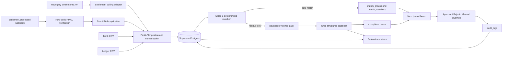

# Reco.ai — AI Agent Build Handoff (Plan C)

This supersedes Plan A and Plan B. Build Plan C: Plan A’s financial correctness and evaluation discipline, plus only the useful implementation/UI structure from Plan B.

## Objective

Build a working AI Finance Controller that reconciles a fixed **100-case synthetic batch** across Razorpay settlements, bank statements, and an internal ledger.

The demo must show:

- deterministic reconciliation first;
- AI classification only for unresolved residue;
- measured deterministic accuracy and AI faithfulness;
- an honest unresolved exception list;
- human approval/rejection/manual override with an audit trail;
- graceful handling of duplicate events, bad input, duplicate UTRs, and LLM failure.

Track 04 explicitly expects a 50+ record finance-ops batch, match-rate reporting, and exceptions that could not be resolved. [Razorpay AI Buildathon](https://razorpay.com/buildathon/)

## Non-negotiable implementation rules

1. Use **integer paise** for every monetary field. Never use floats.
2. Store synthetic truth labels separately from source data. The matcher, prompts, raw payloads, and UI must never receive a scenario label.
3. Never auto-match an ambiguous candidate or duplicate UTR.
4. The LLM may classify and recommend; it may not post ledger entries or silently resolve records.
5. Every state change must create an append-only `audit_logs` record.
6. Test the LLM layer with a fake classifier; CI must not depend on Groq availability.
7. Use `settlement.processed` as the real webhook event. Treat `created` as a settlement status discovered by polling, not as a webhook. [Settlement API](https://razorpay.com/docs/api/settlements/fetch-all/?preferred-country=IN) · [Settlement webhooks](https://razorpay.com/docs/webhooks/settlements/?preferred-country=US)
8. Do not add Prisma, partitioning, formal circuit breakers, SRE uptime claims, or broad rate-limit infrastructure.
9. Do not invent Razorpay rubric weights.
10. Clearly label all fixtures and demo data as synthetic.

## Fixed stack decisions

```text
Frontend: Next.js + TypeScript
Backend: FastAPI + Python
Database: Supabase Postgres
ORM and migrations: SQLAlchemy 2.x + Alembic
Data processing: Pandas
LLM: Groq behind an ExceptionClassifier interface
Structured output: Pydantic
Tests: pytest + mocked classifier
Auth for MVP: named seeded demo controller, visibly marked “Demo mode”
```

If the repository already has an equivalent ORM/migration setup, preserve it. Otherwise, use SQLAlchemy and Alembic; do not introduce Prisma into the Python backend.

## Architecture



## Razorpay integration contract

Before implementing adapters, save official example payloads in `docs/contracts/` with source URLs and retrieval date.

Use:

- `GET /v1/settlements/` for settlement polling.
- `GET /v1/settlements/recon/combined` only for enrichment where required.
- `settlement.processed` webhook for settlement processing notifications.

Webhook handling requirements:

- Verify `X-Razorpay-Signature` against the **raw request body**.
- Deduplicate using `x-razorpay-event-id`.
- Accept duplicate and out-of-order delivery.
- Persist the raw event before asynchronous processing.

Razorpay documents raw-body HMAC verification, idempotency using the event ID, and possible out-of-order events. [Webhook validation and idempotency](https://razorpay.com/docs/webhooks/validate-test/?locale=en-US)

Use distinct function names:

```text
compute_webhook_signature(raw_body, secret)
validate_razorpay_webhook(request)
```

Do not create two functions named `verify_webhook_signature`.

## Canonical data contracts

### Normalized transaction

```text
id: UUID
org_id: UUID
source_id: UUID
ingestion_run_id: UUID
external_id: string
transaction_kind: settlement | bank_credit | bank_debit | ledger_entry | refund | adjustment
direction: credit | debit
amount_paise: BIGINT
gross_amount_paise: BIGINT nullable
fee_paise: BIGINT nullable
tax_paise: BIGINT nullable
refund_amount_paise: BIGINT nullable
currency: string
effective_date: DATE
posted_at: TIMESTAMPTZ nullable
utr: string nullable
reference_id: string nullable
narration: string nullable
raw_payload: JSONB
normalization_version: string
created_at: TIMESTAMPTZ
```

Rules:

- Canonical credits are positive; debits are negative.
- Razorpay `amount` is mapped directly as paise.
- If a CSV reports rupees, convert using `Decimal` and explicit rounding at ingestion only.
- `raw_payload` may contain original source fields, but never scenario labels, ground truth, expected class, or hidden flags.

### AI exception response

```text
classification:
  fee_delta
  refund_lag
  fx_rounding
  duplicate_reference
  timing_gap
  unrecognized_credit
  insufficient_evidence

confidence: 0.000 to 1.000
evidence_transaction_ids: UUID[]
calculation_summary: string
explanation: string
recommended_next_step: string
requires_human_review: true
```

The model must always set `requires_human_review=true`.

## Database schema to implement

| Table | Required fields and constraints |
|---|---|
| `sources` | `id`, `org_id`, `kind`, `name`, `config_json`, timestamps |
| `ingestion_runs` | `id`, `source_id`, `file_name`, `file_hash`, status, record counts, timestamps |
| `webhook_events` | `id`, unique `provider_event_id`, event type, signature validity, raw payload, timestamps |
| `transactions` | Canonical transaction fields above; unique `(source_id, external_id)` |
| `match_groups` | `id`, `org_id`, strategy, status, deterministic score, expected/actual/delta paise, rule trace JSON, timestamps |
| `match_members` | `match_group_id`, `transaction_id`, role, allocated paise; supports multi-row and partial cases |
| `exceptions` | `id`, optional match group/transaction IDs, status, taxonomy, confidence, evidence JSON, model name, prompt version, response JSON, faithfulness score, retry count |
| `audit_logs` | `id`, actor ID, action, entity type/ID, previous state, new state, reason, request ID, created timestamp |
| `evaluation_runs` | fixed seed, fixture version, calculated metrics, run timestamp |
| `ground_truth_labels` | evaluation-only data keyed by opaque source record IDs; never queried by normal app flows |

Use `BIGINT` for money and `NUMERIC(4,3)` for confidence/faithfulness scores.

Ground truth must be physically isolated:

- fixture source: `fixtures/ground_truth.json`;
- optional database location: separate `evaluation` schema;
- runtime API and LLM modules must not import or query ground-truth files/tables.

## Synthetic-data generator contract

Generate **100 cases**, not an assumed one-to-one set of source rows:

| Case type | Count | Expected system behavior |
|---|---:|---|
| Perfect matches | 60 | Deterministic auto-match |
| Fee deductions | 15 | Bank/settlement match; ledger variance explained |
| Partial refunds | 10 | AI triage or unresolved, depending on evidence |
| Duplicate UTRs | 5 | Never auto-match |
| Unrecognized credits | 10 | Honest unresolved exception |

Generator output:

```text
fixtures/
  razorpay_settlements.json
  bank_statement.csv
  ledger.csv
  ground_truth.json
  manifest.json
```

Requirements:

- Use `--seed` for reproducibility.
- Flatten all generated source records before serialization.
- A duplicate-UTR case may create two Razorpay rows.
- An unrecognized-credit case may create zero Razorpay rows.
- Do not append nested lists or `None` as transaction rows.
- Use opaque IDs such as UUIDs; never encode class names in IDs or narrations.
- `ground_truth.json` maps source IDs to expected outcomes, but is not passed to normal runtime logic.

Add a regression test that recursively scans every runtime payload and prompt fixture for forbidden truth-label keys.

## Deterministic matcher

Implement Stage 1 in this strict order:

1. Normalize UTR/reference values: trim, uppercase, remove safe punctuation.
2. Normalize dates to `effective_date`.
3. Filter bank-credit candidates against processed Razorpay settlements.
4. Auto-match only if one of these holds:
   - unique exact UTR plus exact paise amount;
   - unique exact amount plus date within ±2 days.
5. If UTR is duplicated, candidate count is greater than one, amount conflicts, or currency differs: send to review/residue.
6. Compute known accounting equations before AI:
   - settlement net;
   - ledger gross minus known fee/tax/refund amounts;
   - bank settlement credit.
7. Persist rule trace, candidates considered, amount delta, and strategy.
8. Never use fuzzy narration similarity as an automatic acceptance rule.

Suggested strategy labels:

```text
UTR_EXACT
AMOUNT_DATE_UNIQUE
LEDGER_NET_EXACT
DUPLICATE_UTR_REVIEW
AMBIGUOUS_REVIEW
UNMATCHED
```

Generate `batch_id = uuid4()` at the beginning of every reconciliation run.

## AI residue classifier

Create an interface:

```text
ExceptionClassifier.classify(evidence_pack) -> ExceptionClassification
```

Implement two providers:

```text
GroqExceptionClassifier
FakeExceptionClassifier
```

`FakeExceptionClassifier` is used in all tests and the transparent offline demo fallback.

Evidence pack contents:

- normalized source records;
- candidate record IDs;
- deterministic calculations;
- rule trace;
- allowed taxonomy;
- no hidden scenario labels;
- no unrelated customer PII.

Implementation requirements:

- Use a proper LangChain message-template form, not raw message objects with unverified placeholders.
- Add a test that renders the prompt and confirms no `{placeholder}` remains.
- Validate Pydantic output.
- Permit one JSON-repair retry only.
- Use bounded concurrency of three AI calls.
- Retry one transient provider failure with short backoff.
- On timeout, invalid JSON, or provider failure, create a visible exception with status `MODEL_UNAVAILABLE` or `INVALID_MODEL_OUTPUT`.
- Do not fall back to a guessed classification.

## Evaluation and reporting

Display these metrics separately. Do not combine them into invented weighted scores.

```text
Deterministic Match Score
= correct deterministic auto-matches / deterministic auto-matches

Deterministic Coverage
= deterministic auto-matches / eligible matchable cases

Batch Match Rate
= correctly resolved groups / eligible groups

Exception Recall
= surfaced known exceptions / known exceptions

AI Classification Accuracy
= correct AI classifications / AI-classified test cases

LLM Faithfulness Score
= mean evidence-support score across evaluated AI explanations
```

Faithfulness workflow:

1. Deterministically verify cited IDs exist and calculations agree.
2. Optionally send the evidence and explanation to a separate constrained judge prompt.
3. Use the judge only as an explanation-quality metric.
4. Never use the judge to resolve an exception or replace ground-truth accuracy.

The dashboard must always show:

- total cases and total source records;
- deterministic matches;
- AI-triaged exceptions;
- approved/rejected/overridden exceptions;
- unresolved exceptions;
- downloadable Honest Exception List.

## FastAPI endpoints

```text
POST   /api/imports/bank
POST   /api/imports/ledger
POST   /api/razorpay/sync
POST   /api/webhooks/razorpay
POST   /api/reconciliation-runs
GET    /api/reconciliation-runs/{run_id}
GET    /api/reconciliation-runs/{run_id}/metrics
GET    /api/exceptions
GET    /api/exceptions/{exception_id}
POST   /api/exceptions/{exception_id}/decision
GET    /api/audit-logs
```

`POST /api/exceptions/{id}/decision` accepts:

```text
action: approve | reject | manual_override
reason: required for reject and override
override_classification: required for manual_override
```

The decision endpoint must use one database transaction:

1. validate state transition;
2. update exception/match status;
3. insert audit row;
4. return updated exception and audit event.

## Next.js dashboard

Create:

```text
DashboardMetrics
BatchRunSummary
SourceUploadPanel
MatchTable
ExceptionReviewCard
EvidenceDrawer
AuditTimeline
EvaluationPanel
```

`ExceptionReviewCard` must show facts before AI prose:

1. linked bank, Razorpay, and ledger records;
2. amounts, dates, UTR/reference, and deterministic delta;
3. AI classification, confidence, calculation, and cited evidence IDs;
4. Approve, Reject, Manual Override actions;
5. audit timeline;
6. visible status: unresolved items must never appear “resolved” merely because AI proposed an explanation.

MVP auth decision:

- seed a `demo_finance_controller` actor;
- display `Demo mode — single reviewer`;
- write this actor to every audit log;
- do not claim multi-user production authorization.

## Target repository structure

```text
web/
  app/
  components/reconciliation/
  lib/api/

backend/
  app/main.py
  app/routers/
  app/models/
  app/services/ingestion/
  app/services/matching/
  app/services/ai/
  app/services/evaluation/
  tests/

supabase/
  migrations/

scripts/
  generate_synthetic_data.py
  run_fixture_evaluation.py

fixtures/
docs/contracts/
docs/
  architecture.md
  demo-script.md
```

## Required tests and CI

Minimum test suite:

```text
test_money_is_integer_paise
test_generator_emits_flat_source_records
test_generator_has_no_truth_leakage
test_duplicate_utr_never_auto_matches
test_amount_date_unique_auto_matches
test_webhook_rejects_invalid_hmac
test_webhook_deduplicates_event_id
test_prompt_renders_all_variables
test_invalid_llm_json_becomes_exception
test_llm_timeout_becomes_exception
test_decision_creates_audit_log
test_fixed_seed_end_to_end_metrics
```

CI must run linting and these tests. It must not call live Razorpay or Groq APIs.

Repository hygiene:

- commit `.env.example`, never `.env`;
- use only synthetic fixtures;
- add a README statement that no live merchant/customer data is included;
- use a pre-push or CI secret scan if time permits.

## 48-hour execution sequence

| Time | Build target |
|---|---|
| 0–3h | Freeze contracts, initialize backend/frontend, migration setup, environment template |
| 3–8h | Generator, fixtures, ground-truth isolation tests |
| 8–15h | Database schema, imports, normalization, deterministic matcher |
| 15–20h | Webhook validation, event dedupe, Razorpay fixture adapter |
| 20–26h | AI classifier interface, Groq provider, fake classifier, structured-output tests |
| 26–33h | Reconciliation APIs, metrics, audit decision transaction |
| 33–39h | Dashboard, exception review card, audit timeline |
| 39–44h | E2E fixture evaluation, CI, failure simulations |
| 44–48h | Demo script, recorded fallback run, screenshots/video, README cleanup |

## Demo fallback rule

Provide two explicit modes:

```text
Live AI run
Fixture demo run
```

The fixture run uses the fixed dataset and fake/cached classifier results. Label it visibly. It is a reliability fallback, not evidence of a live AI response.

## Judge defense

**Why not use AI for all reconciliation?**  
Money matching is deterministic when the evidence is sufficient. AI is reserved for ambiguous residue, where it explains the exception and suggests review action without changing books.

**How is the reported accuracy trustworthy?**  
The fixed-seed ground truth is isolated from transaction payloads and model prompts. Precision, coverage, exception recall, classification accuracy, and explanation faithfulness are reported separately.

**What happens if webhooks or the LLM fail?**  
Webhook events are signature-validated, idempotent, and stored before processing. A failed AI call produces a visible unresolved exception; no event is dropped and no ledger entry is changed automatically.

# Reco.ai — Phase-by-phase build and verification plan

Do not advance a phase until its exit gate passes. Build against fixtures first; live Razorpay/Groq integration is optional until the core loop is proven.

## Phase 0 — Contract lock and scope freeze (Hours 0–2)

**Build**

- Save official Razorpay settlement and webhook examples under `docs/contracts/`.
- Define canonical transaction, exception, and audit-log contracts.
- Create `.env.example`.
- Freeze the 100-case synthetic distribution and metric definitions.
- Record explicit non-goals: no Prisma, no auto-ledger posting, no fake `settlement.created` webhook.

**Test**

- Parse the saved Razorpay settlement fixture with a Pydantic model.
- Confirm the webhook fixture is `settlement.processed`.
- Assert no fixture contains real credentials or customer data.

**Verify / exit gate**

- Every field used by ingestion exists in an official or fixture-backed contract.
- The team can explain: “poll for settlement state; webhook on processed.”

---

## Phase 1 — Project skeleton and database foundation (Hours 2–5)

**Build**

- FastAPI application structure, Next.js API client shell, SQLAlchemy models, Alembic setup.
- Create migrations for `sources`, `ingestion_runs`, `transactions`, `match_groups`, `match_members`, `exceptions`, `audit_logs`, `webhook_events`, and evaluation tables.
- Seed one `demo_finance_controller` actor.

**Test**

- Run migration upgrade on an empty database.
- Insert one source, transaction, match group, exception, and audit record.
- Assert uniqueness of `(source_id, external_id)` and webhook `provider_event_id`.

**Verify / exit gate**

- Database starts cleanly and migrations run from scratch.
- All monetary database columns are `BIGINT`.
- Audit records can be inserted without modifying prior records.

---

## Phase 2 — Synthetic data generator and truth isolation (Hours 5–9)

**Build**

- `generate_synthetic_data.py --seed <value>`.
- Generate:
  - 60 perfect matches;
  - 15 fee deductions;
  - 10 partial refunds;
  - 5 duplicate UTR cases;
  - 10 unrecognized bank credits.
- Write source files and a separate `ground_truth.json`.

**Test**

- Same seed produces identical output hashes.
- Generator emits only flat transaction rows—never nested lists or `None`.
- Duplicate UTR emits multiple valid source rows.
- Unrecognized credit emits no Razorpay settlement row.
- Recursively scan runtime payloads for prohibited keys such as `scenario`, `expected_class`, `duplicate_flag`, or `unrecognized`.

**Verify / exit gate**

- There are exactly 100 cases, even if source-row counts differ.
- Ground truth is not present in bank CSVs, Razorpay fixtures, ledger fixtures, or LLM evidence packs.

---

## Phase 3 — Ingestion and normalization (Hours 9–13)

**Build**

- Bank CSV import endpoint.
- Ledger CSV import endpoint.
- Razorpay fixture/API normalization adapter.
- Canonical normalization for UTR, references, dates, currency, and signed paise amounts.
- Ingestion run tracking with accepted/rejected row counts.

**Test**

- Valid bank, ledger, and Razorpay fixtures import successfully.
- Invalid date, missing mandatory ID, invalid currency, and malformed money values are rejected with row-level errors.
- `19.99` rupees converts safely to `1999` paise using `Decimal`, never float arithmetic.
- Re-importing the same file does not duplicate rows.

**Verify / exit gate**

- Imported rows have normalized IDs, dates, and integer paise.
- Dashboard/API can report import counts and rejected-row reasons.

---

## Phase 4 — Deterministic matching engine (Hours 13–19)

**Build**

- Candidate generation with this order:
  1. unique UTR + exact amount;
  2. unique exact amount + date within ±2 days;
  3. known ledger net equation;
  4. review/residue.
- `match_groups` and `match_members` creation.
- Rule trace and amount-delta persistence.

**Test**

- Perfect match auto-matches.
- Exact UTR with amount mismatch does not auto-match.
- Duplicate UTR never auto-matches.
- Multiple amount/date candidates never auto-match.
- Known fee/tax equation resolves deterministically when evidence is sufficient.
- Cross-currency records do not match.
- Every auto-match has a rule trace.

**Verify / exit gate**

- The 60 perfect cases reconcile without AI.
- Every ambiguous case remains review-required.
- Deterministic Match Score and Coverage calculate correctly against isolated truth.

---

## Phase 5 — Razorpay webhook and failure recovery (Hours 19–22)

**Build**

- `POST /api/webhooks/razorpay`.
- Raw-body HMAC validation.
- Event-ID deduplication.
- Polling adapter for settlement status discovery.
- Persistent webhook event storage before processing.

**Test**

- Valid HMAC is accepted.
- Invalid HMAC is rejected.
- Same event ID twice creates one processed event.
- Out-of-order event handling does not corrupt settlement state.
- Processing failure leaves an observable retryable state.

**Verify / exit gate**

- Webhook logic does not parse the request body before signature verification.
- No duplicate event can create duplicate transactions or match groups.

---

## Phase 6 — AI residue classifier (Hours 22–28)

**Build**

- `ExceptionClassifier` interface.
- `FakeExceptionClassifier` for tests and fixture demo mode.
- `GroqExceptionClassifier` with configurable model name.
- Pydantic structured output.
- Evidence-pack builder containing only relevant normalized facts.
- One retry for transient provider failure and bounded concurrency.

**Test**

- Prompt rendering replaces all placeholders.
- Valid model JSON parses.
- Invalid JSON becomes `INVALID_MODEL_OUTPUT`.
- Timeout becomes `MODEL_UNAVAILABLE`.
- Low confidence remains unresolved.
- AI output cannot set `requires_human_review=false`.
- AI call never writes ledger or match approval state.

**Verify / exit gate**

- The LLM receives no truth labels.
- Every AI result has evidence IDs, calculation summary, confidence, and a review requirement.
- The entire app works using `FakeExceptionClassifier` with no network access.

---

## Phase 7 — Evaluation, decisions, and audit trail (Hours 28–33)

**Build**

- Reconciliation-run endpoint and metrics endpoint.
- Exception approve/reject/manual-override endpoint.
- Transactional audit logging.
- Evaluation command that reads isolated ground truth.
- Faithfulness evaluator: deterministic evidence checks first, optional LLM judge second.

**Test**

- Approve, reject, and override each create exactly one audit entry.
- Reject/override require a reason.
- A manual override preserves the prior AI recommendation and rule trace.
- Evaluation code cannot run through normal ingestion/matching paths.
- Metric denominators are nonzero-safe and correct.

**Verify / exit gate**

- Dashboard/API returns:
  - Deterministic Match Score;
  - Deterministic Coverage;
  - Batch Match Rate;
  - Exception Recall;
  - AI Classification Accuracy;
  - LLM Faithfulness Score.
- Unresolved exceptions remain visible and exportable.

---

## Phase 8 — Dashboard and reviewer workflow (Hours 33–39)

**Build**

- `DashboardMetrics`
- `BatchRunSummary`
- `SourceUploadPanel`
- `MatchTable`
- `ExceptionReviewCard`
- `EvidenceDrawer`
- `AuditTimeline`
- `EvaluationPanel`

**Test**

- Load a completed fixture run.
- Open an exception and confirm all source facts appear before AI prose.
- Approve, reject, and manual override from the UI.
- Refresh the page and confirm audit timeline/state persist.
- Typecheck and lint frontend.

**Verify / exit gate**

- The reviewer can understand why a record is unmatched without trusting AI text.
- The UI visibly distinguishes `auto-matched`, `review required`, `approved`, and `unresolved`.
- “Demo mode — single reviewer” is visible.

---

## Phase 9 — End-to-end hardening and demo proof (Hours 39–48)

**Build**

- GitHub Actions for lint + tests.
- `run_fixture_evaluation.py`.
- Transparent “Live AI run” and “Fixture demo run” modes.
- README architecture, setup steps, limitations, metrics definitions, and synthetic-data statement.
- Five-minute demo script.

**Test**

- Run full fixed-seed batch from an empty database.
- Test duplicate UTR, invalid webhook signature, malformed CSV, LLM timeout, and invalid LLM JSON.
- Run all tests without Razorpay or Groq credentials.
- Confirm no `.env`, keys, or real data are staged for commit.

**Verify / exit gate**

- One command seeds/imports/runs the 100-case fixture.
- One command runs tests.
- The dashboard shows metrics and the Honest Exception List.
- Fixture fallback is visibly labelled, never disguised as a live model result.
- Demo can continue if Groq is unavailable.

## Final acceptance checklist

Before handoff or submission, confirm:

- [ ] 100-case batch runs successfully.
- [ ] Perfect matches reconcile deterministically.
- [ ] Duplicate UTRs never auto-match.
- [ ] Ground truth is isolated and test-enforced.
- [ ] All money values are integer paise.
- [ ] AI only handles residue and cannot write books.
- [ ] Every reviewer decision has an immutable audit event.
- [ ] Webhooks are HMAC-validated and idempotent.
- [ ] Metrics and unresolved exceptions are visible.
- [ ] Tests and fixture demo run without external APIs.